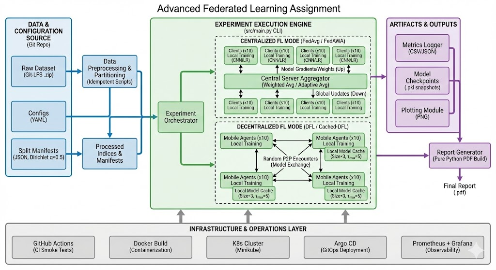

# Advanced Federated Learning Assignment

This repository contains an incremental implementation of the Advanced Federated Learning programming assignment.

## Architecture




## Current Status

- Implemented: Part 1 (repo bootstrap and developer ergonomics), Part 2 (dataset handling + preprocessing), Part 3 (Dirichlet non-IID partitioning), Part 4 (model + train/eval utilities + serialization), Part 5 (FedAvg end-to-end experiment), Part 6 (FedAWA + FedAvg comparison), Part 7 (DFL baseline without caching), Part 8 (Cached-DFL + comparison)
- Pending: Parts 9-13

## Quick Start

1. Ensure `python3.11` is installed.
2. Create/update virtual environment and install dependencies:

```bash
./scripts/dev/bootstrap_venv.sh
```

3. Run developer checks:

```bash
make lint
make format-check
make test
```

4. Run the placeholder CLI:

```bash
make run
```

## Dataset Pipeline (Part 2)

### 1) Acquire zip (idempotent)

Preferred: pre-place the zip here:

- `data/raw/cats-and-dogs-classification-dataset.zip`

Then run:

```bash
./scripts/data/get_dataset.sh
```

If the zip is already present, the script reuses it and exits.
If missing, it will attempt Kaggle download only when credentials are configured
(`KAGGLE_USERNAME`/`KAGGLE_KEY` or `~/.kaggle/kaggle.json`).

Optional download overrides:

- `KAGGLE_DATASET` (default: `tongpython/cat-and-dog`)
- `KAGGLE_FILE` (required when the dataset has multiple zip files)

### 2) Extract and preprocess (idempotent)

```bash
./scripts/data/preprocess_dataset.sh
```

This script:

- extracts the zip into `data/extracted/` with checksum marker files
- builds image index at `data/processed/image_index.jsonl`
- generates deterministic train/test split manifest at `data/splits/train_test_manifest.json`

Optional env overrides:

- `SPLIT_SEED` (default: `42`)
- `TRAIN_RATIO` (default: `0.8`)

## Dirichlet Non-IID Client Partitioning (Part 3)

After preprocessing creates `data/processed/image_index.jsonl` and
`data/splits/train_test_manifest.json`, generate a 10-client non-IID split using
Dirichlet `alpha=0.5`:

```bash
.venv/bin/python -m src.data.partition_dirichlet
```

Outputs:

- Client partition manifest: `data/splits/dirichlet_clients_manifest.json`
- Distribution sanity table: `data/splits/dirichlet_clients_sanity.csv`

Optional flags:

- `--num-clients` (default: `10`)
- `--alpha` (default: `0.5`)
- `--seed` (default: `42`)
- `--source-split` (default: `train`)

## Model + Training Utilities (Part 4)

Part 4 adds reusable training primitives for upcoming FL experiments:

- CNN model: `src/models/simple_cnn.py`
- Tensor dataset adapters: `src/data/torch_dataset.py`
- Local train/eval loops: `src/common/train_eval.py`
- `.pkl` snapshot save/load: `src/common/serialization.py`
- CSV metrics logger: `src/common/metrics.py`

Example snapshot path convention:

- `artifacts/models/<experiment_name>/round_<n>.pkl`

The snapshot payload structure is:

```python
{
    "model_name": "...",
    "round": 0,
    "state_dict": {...},
    "config": {...},
    "metrics": {...},
    "timestamp": "...",
}
```

## FedAvg End-to-End Experiment (Part 5)

Run the graded FedAvg baseline (10 clients, Dirichlet alpha `0.5`, 50 rounds,
dataset-size weighted aggregation):

```bash
./scripts/experiments/run_fedavg.sh
```

Optional config override:

```bash
./scripts/experiments/run_fedavg.sh configs/fedavg.yaml
```

Outputs:

- Metrics CSV: `artifacts/metrics/fedavg/metrics.csv`
- Model snapshots: `artifacts/models/fedavg/round_<n>.pkl`
- Accuracy plot: `artifacts/plots/fedavg/accuracy_vs_rounds.png`

Equivalent direct CLI:

```bash
.venv/bin/python -m src.main fedavg --config configs/fedavg.yaml
```

## FedAWA + FedAvg Comparison (Part 6)

Run FedAWA under the same training setup as FedAvg. By default, this command
also executes FedAvg baseline first and writes a comparison plot:

```bash
./scripts/experiments/run_fedawa.sh
```

Optional config override:

```bash
./scripts/experiments/run_fedawa.sh configs/fedawa.yaml
```

Outputs:

- FedAWA metrics CSV: `artifacts/metrics/fedawa/metrics.csv`
- FedAWA snapshots: `artifacts/models/fedawa/round_<n>.pkl`
- FedAWA accuracy plot: `artifacts/plots/fedawa/accuracy_vs_rounds.png`
- FedAvg vs FedAWA comparison plot: `artifacts/plots/comparison/fedavg_vs_fedawa_accuracy.png`

FedAWA formulas used in this implementation:

- Client vector: `tau_k^t = theta_k^t - theta_g^{t-1}`
- Global direction: `Delta_g^t = theta_g^{t-1} - theta_g^{t-2}`
- Alignment: `a_k^t = cosine(tau_k^t, Delta_g^t)`
- Adaptive aggregation:
  `w_k^t = [n_k * max(a_k^t, 0)] / sum_j[n_j * max(a_j^t, 0)]`

Negative alignment handling:

- Any negative cosine value is clipped to `0`.
- If all clipped alignments are `0` (or direction is unavailable/degenerate),
  aggregation falls back to dataset-size weighting (FedAvg-style).

## DFL Baseline (No Caching) (Part 7)

Run decentralized federated learning with 10 agents and random pairwise
encounters (no central server, no cache):

```bash
./scripts/experiments/run_dfl.sh
```

Optional config override:

```bash
./scripts/experiments/run_dfl.sh configs/dfl.yaml
```

Communication round definition used in this implementation:

- One communication round includes:
  1. Local training on each agent's private partition for the configured local
     epochs.
  2. Random pairwise encounters (without replacement) where each encountered
     pair replaces both local models with their parameter-wise average.

Default encounters per round for 10 agents is 5 (a full random matching).

Outputs:

- Metrics CSV (mean across agents): `artifacts/metrics/dfl/metrics.csv`
- Per-agent model snapshots: `artifacts/models/dfl/round_<r>_agent_<k>.pkl`
- Accuracy plot (mean test accuracy vs rounds):
  `artifacts/plots/dfl/accuracy_vs_rounds.png`

## Cached-DFL + Comparison (Part 8)

Run Cached-DFL (`cache_size=3`, `tau_max=5`) and compare it against no-cache DFL:

```bash
./scripts/experiments/run_cached_dfl.sh
```

Optional config override:

```bash
./scripts/experiments/run_cached_dfl.sh configs/cached_dfl.yaml
```

Cached-DFL round semantics:

- Before local training, each agent removes stale cache entries where
  `current_round - round_seen > tau_max`.
- The agent warm-starts local training from the parameter-wise average of:
  - its current model
  - all non-stale cached models
- During each random pairwise encounter, both agents average current models (same
  as Part 7), and each caches the peer's pre-encounter model.
- Cache is bounded to the most recent `cache_size` models (newer entries replace
  older ones; same-source entries are updated in-place).

Outputs:

- Cached-DFL metrics CSV: `artifacts/metrics/cached_dfl/metrics.csv`
- Cached-DFL snapshots: `artifacts/models/cached_dfl/round_<r>_agent_<k>.pkl`
- Cached-DFL accuracy plot: `artifacts/plots/cached_dfl/accuracy_vs_rounds.png`
- No-cache vs cached comparison plot:
  `artifacts/plots/comparison/dfl_vs_cached_dfl_accuracy.png`

## Repository Layout

```text
.github/workflows/
configs/
data/
  raw/
  extracted/
  processed/
  splits/
src/
  common/
  data/
  models/
  fl/
  dfl/
  plotting/
scripts/
  dev/
  data/
  experiments/
  k8s/
docker/
k8s/
  monitoring/
report/
tests/
```
